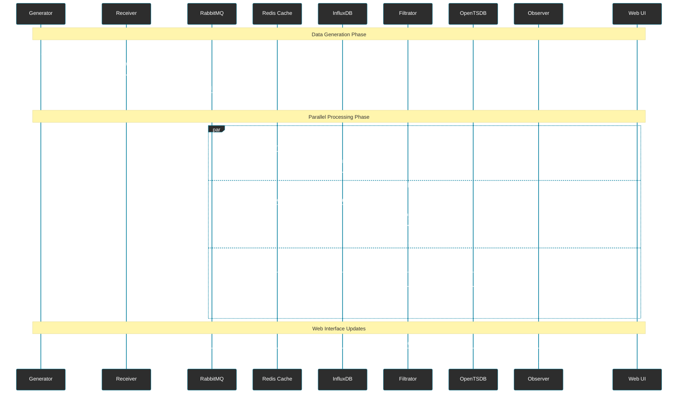
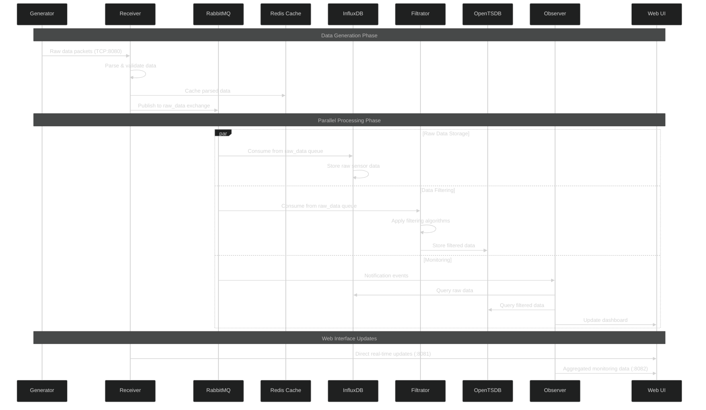

# Mermaid диаграммы не всегда корректно экспортируются в PDF

## 1. Используйте Mermaid CLI для генерации изображений
* **Установите Mermaid CLI:**
```bash
npm install -g @mermaid-js/mermaid-cli
```
* **Создайте отдельные файлы диаграмм:**
  * **architect.mmd** 

* **Генерируйте изображения:**
```bash
mmdc -i md/modern1/architect.mmd -o md/modern1/architect.png
mmdc -i md/modern1/architect.mmd -o md/modern1/architect.svg
```

## 2. Создайте скрипт для автоматической генерации generate-diagrams.sh
```bash
#!/bin/bash

# generate-diagrams.sh

# Создаем директорию для изображений
mkdir -p md/modern1/images

# Генерируем PNG изображения
mmdc -i md/modern1/architect.mmd -o md/modern1/images/architect.png -w 1200 -H 800
mmdc -i md/modern1/dataflow.mmd -o md/modern1/images/dataflow.png -w 1200 -H 800

# Генерируем SVG (векторные изображения)
mmdc -i md/modern1/architect.mmd -o md/modern1/images/architect.svg
mmdc -i md/modern1/dataflow.mmd -o md/modern1/images/dataflow.svg

echo "Диаграммы сгенерированы в md/modern1/images/"
```
* **Сделайте скрипт исполняемым:**
```bash
chmod +x scripts/generate-diagrams.sh
```

## 3. Обновите Markdown файлы с ссылками на изображения
    architect-with-images.md
### System Architecture

#### Sequence Diagram


*Диаграмма последовательности взаимодействия компонентов системы*

#### Component Flow


*Схема потоков данных между компонентами*

---

### Mermaid Source Code

<details>
<summary>Исходный код диаграммы последовательности</summary>



</details>
```

## 4. Создайте Makefile для автоматизации

```makefile:Makefile
.PHONY: diagrams pdf clean

# Генерация диаграмм
diagrams:
	@echo "Генерация диаграмм..."
	@mkdir -p md/modern1/images
	@mmdc -i md/modern1/architect.mmd -o md/modern1/images/architect.png -w 1200 -H 800
	@mmdc -i md/modern1/architect.mmd -o md/modern1/images/architect.svg
	@echo "Диаграммы сгенерированы!"

# Генерация PDF с изображениями
pdf: diagrams
	@echo "Генерация PDF..."
	@pandoc md/modern1/architect-with-images.md -o md/modern1/architect.pdf --pdf-engine=wkhtmltopdf
	@echo "PDF сгенерирован!"

# Очистка
clean:
	@rm -rf md/modern1/images/
	@rm -f md/modern1/*.pdf
	@echo "Очистка завершена!"
```

## 5. Запустите генерацию

```bash
make diagrams
```

```bash
make pdf
```


Теперь у вас будут PNG/SVG изображения диаграмм, которые корректно отобразятся в PDF!