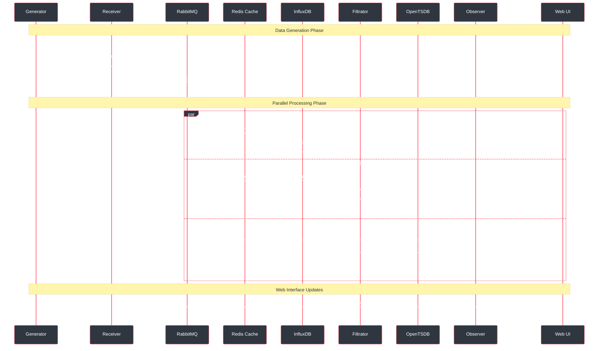

# System Architecture

```mermaid
%%{init: {
  'theme': 'base',
  'themeVariables': {
    'primaryColor': '#ff6b6b',
    'primaryTextColor': '#ffffff',
    'primaryBorderColor': '#ff4757',
    'lineColor': '#5f27cd',
    'secondaryColor': '#00d2d3',
    'tertiaryColor': '#ff9ff3',
    'background': '#2f3640',
    'mainBkg': '#2f3640',
    'secondBkg': '#40739e',
    'tertiaryBkg': '#487eb0'
  }
}}%%

sequenceDiagram
    participant G as Generator
    participant R as Receiver
    participant MQ as RabbitMQ
    participant C as Redis Cache
    participant I as InfluxDB
    participant F as Filtrator
    participant O as OpenTSDB
    participant Obs as Observer
    participant W as Web UI

    Note over G,W: Data Generation Phase
    G->>R: Raw data packets (TCP:8080)
    R->>R: Parse & validate data
    R->>C: Cache parsed data
    R->>MQ: Publish to raw_data exchange
    
    Note over G,W: Parallel Processing Phase
    par Raw Data Storage
        MQ->>I: Consume from raw_data queue
        I->>I: Store raw sensor data
    and Data Filtering
        MQ->>F: Consume from raw_data queue
        F->>F: Apply filtering algorithms
        F->>O: Store filtered data
    and Monitoring
        MQ->>Obs: Notification events
        Obs->>I: Query raw data
        Obs->>O: Query filtered data
        Obs->>W: Update dashboard
    end

    Note over G,W: Web Interface Updates
    R->>W: Direct real-time updates (:8081)
    Obs->>W: Aggregated monitoring data (:8082)
```
