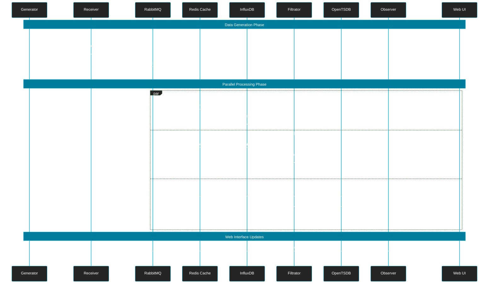

# Go Send-Receive Architecture
## Доступные готовые темы
    default - светлая тема
    dark - темная тема
    forest - зеленая тема
    neutral - нейтральная тема
    base - базовая тема для кастомизации

