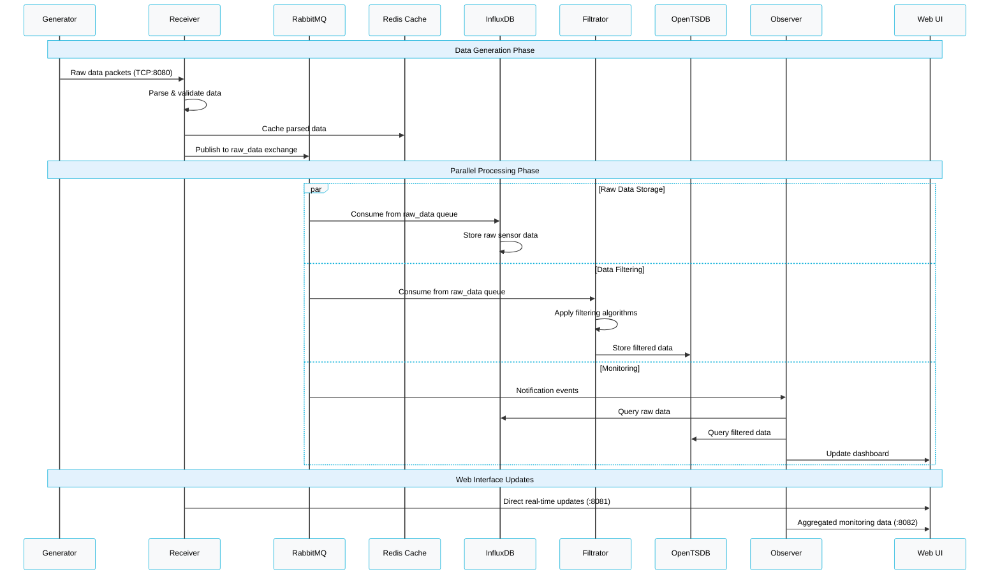
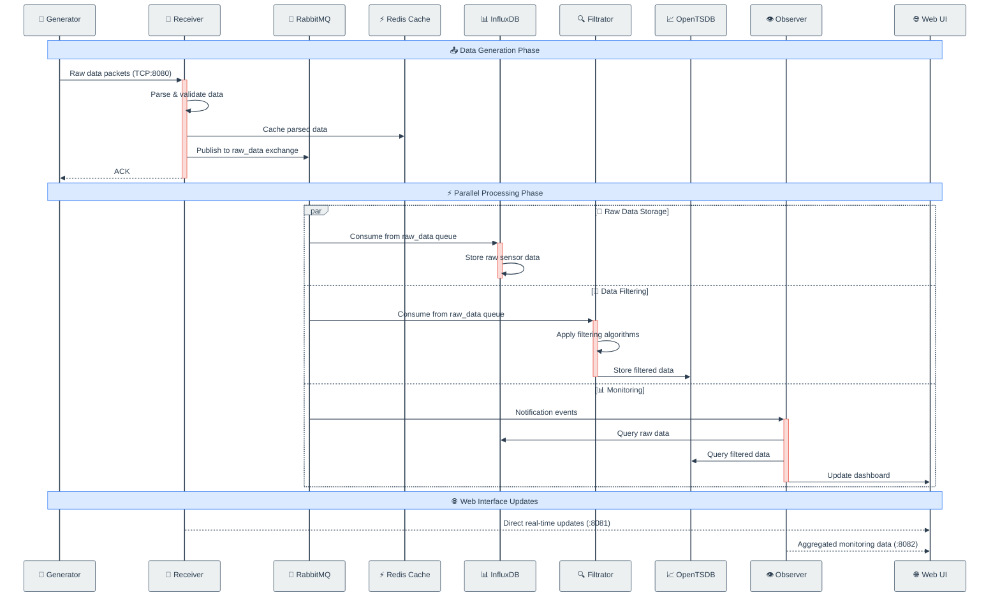
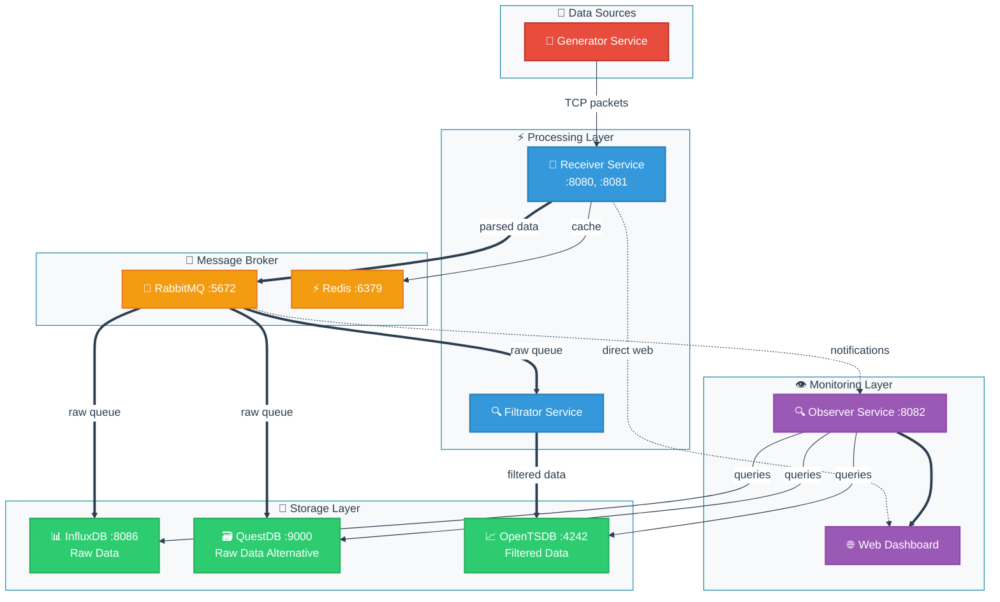

# System Architecture


```

## Альтернативный вариант с Go-стилем и контрастными цветами:

```markdown:md/modern1/architect-go-contrast.md
# Go Send-Receive Architecture


```

## Для dataflow диаграммы:

```markdown:md/modern1/dataflow-contrast.md
## Go Send-Receive - Архитектура компонентов


