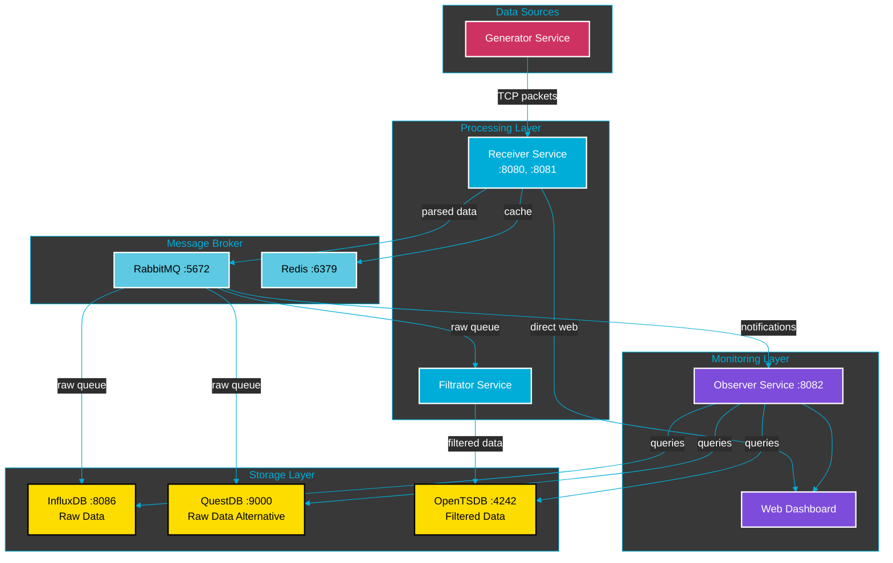

## Mermaid - Архитектура компонентов


```mermaid
%%{init: {
  'theme': 'base',
  'themeVariables': {
    'primaryColor': '#00ADD8',
    'primaryTextColor': '#ffffff',
    'primaryBorderColor': '#007d9c',
    'lineColor': '#00ADD8',
    'secondaryColor': '#5DC9E2',
    'tertiaryColor': '#CE3262',
    'background': '#1a1a1a',
    'mainBkg': '#2d2d2d',
    'secondBkg': '#00ADD8',
    'tertiaryBkg': '#5DC9E2',
    'clusterBkg': '#383838',
    'clusterBorder': '#00ADD8',
    'edgeLabelBackground': '#2d2d2d',
    'nodeTextColor': '#ffffff',
    'titleColor': '#00ADD8'
  }
}}%%

graph TB
    subgraph "Data Sources"
        GEN[Generator Service]
    end
    
    subgraph "Processing Layer"
        REC[Receiver Service<br/>:8080, :8081]
        FILT[Filtrator Service]
    end
    
    subgraph "Message Broker"
        RMQ[RabbitMQ :5672]
        REDIS[Redis :6379]
    end
    
    subgraph "Storage Layer"
        INFLUX[InfluxDB :8086<br/>Raw Data]
        QUEST[QuestDB :9000<br/>Raw Data Alternative]
        OPENTS[OpenTSDB :4242<br/>Filtered Data]
    end
    
    subgraph "Monitoring Layer"
        OBS[Observer Service :8082]
        WEB[Web Dashboard]
    end
    
    %% Data Flow
    GEN -->|TCP packets| REC
    REC -->|parsed data| RMQ
    REC -->|cache| REDIS
    RMQ -->|raw queue| INFLUX
    RMQ -->|raw queue| QUEST
    RMQ -->|raw queue| FILT
    FILT -->|filtered data| OPENTS
    RMQ -->|notifications| OBS
    OBS -->|queries| INFLUX
    OBS -->|queries| QUEST
    OBS -->|queries| OPENTS
    OBS --> WEB
    REC -->|direct web| WEB

    %% Styling
    classDef dataSource fill:#CE3262,stroke:#ffffff,stroke-width:2px,color:#ffffff
    classDef processing fill:#00ADD8,stroke:#ffffff,stroke-width:2px,color:#ffffff
    classDef broker fill:#5DC9E2,stroke:#ffffff,stroke-width:2px,color:#000000
    classDef storage fill:#FDDD00,stroke:#000000,stroke-width:2px,color:#000000
    classDef monitoring fill:#7D4CDB,stroke:#ffffff,stroke-width:2px,color:#ffffff
    
    class GEN dataSource
    class REC,FILT processing
    class RMQ,REDIS broker
    class INFLUX,QUEST,OPENTS storage
    class OBS,WEB monitoring
```
```