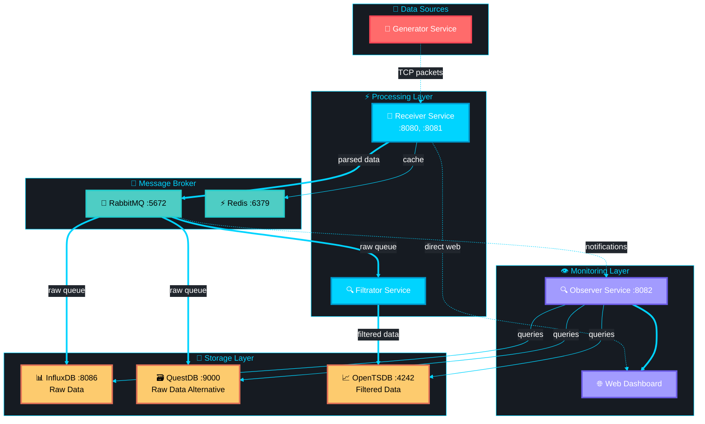

## Mermaid - Архитектура компонентов (Яркая тема)

```mermaid
%%{init: {
  'theme': 'base',
  'themeVariables': {
    'primaryColor': '#00D4FF',
    'primaryTextColor': '#ffffff',
    'primaryBorderColor': '#0099CC',
    'lineColor': '#00D4FF',
    'secondaryColor': '#FF6B6B',
    'tertiaryColor': '#4ECDC4',
    'background': '#0D1117',
    'mainBkg': '#21262D',
    'secondBkg': '#30363D',
    'clusterBkg': '#161B22',
    'clusterBorder': '#00D4FF',
    'edgeLabelBackground': '#21262D',
    'nodeTextColor': '#ffffff',
    'titleColor': '#00D4FF'
  }
}}%%

graph TB
    subgraph DS ["🚀 Data Sources"]
        GEN[🔄 Generator Service]
    end
    
    subgraph PL ["⚡ Processing Layer"]
        REC[📡 Receiver Service<br/>:8080, :8081]
        FILT[🔍 Filtrator Service]
    end
    
    subgraph MB ["💬 Message Broker"]
        RMQ[🐰 RabbitMQ :5672]
        REDIS[⚡ Redis :6379]
    end
    
    subgraph SL ["💾 Storage Layer"]
        INFLUX[📊 InfluxDB :8086<br/>Raw Data]
        QUEST[🗃️ QuestDB :9000<br/>Raw Data Alternative]
        OPENTS[📈 OpenTSDB :4242<br/>Filtered Data]
    end
    
    subgraph ML ["👁️ Monitoring Layer"]
        OBS[🔍 Observer Service :8082]
        WEB[🌐 Web Dashboard]
    end
    
    %% Data Flow with bright colors
    GEN -.->|TCP packets| REC
    REC ==>|parsed data| RMQ
    REC -->|cache| REDIS
    RMQ ==>|raw queue| INFLUX
    RMQ ==>|raw queue| QUEST
    RMQ ==>|raw queue| FILT
    FILT ==>|filtered data| OPENTS
    RMQ -.->|notifications| OBS
    OBS -->|queries| INFLUX
    OBS -->|queries| QUEST
    OBS -->|queries| OPENTS
    OBS ==> WEB
    REC -.->|direct web| WEB

    %% Go-style bright colors
    classDef dataSource fill:#FF6B6B,stroke:#FF4757,stroke-width:3px,color:#ffffff
    classDef processing fill:#00D4FF,stroke:#0099CC,stroke-width:3px,color:#ffffff
    classDef broker fill:#4ECDC4,stroke:#26D0CE,stroke-width:3px,color:#000000
    classDef storage fill:#FDCB6E,stroke:#E17055,stroke-width:3px,color:#000000
    classDef monitoring fill:#A29BFE,stroke:#6C5CE7,stroke-width:3px,color:#ffffff
    
    class GEN dataSource
    class REC,FILT processing
    class RMQ,REDIS broker
    class INFLUX,QUEST,OPENTS storage
    class OBS,WEB monitoring
```
