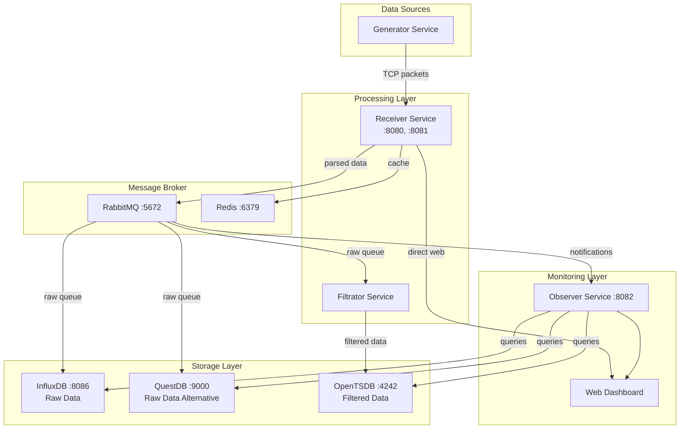

## Mermaid - Архитектура компонентов

```mermaid
graph TB
    subgraph "Data Sources"
        GEN[Generator Service]
    end
    
    subgraph "Processing Layer"
        REC[Receiver Service<br/>:8080, :8081]
        FILT[Filtrator Service]
    end
    
    subgraph "Message Broker"
        RMQ[RabbitMQ :5672]
        REDIS[Redis :6379]
    end
    
    subgraph "Storage Layer"
        INFLUX[InfluxDB :8086<br/>Raw Data]
        QUEST[QuestDB :9000<br/>Raw Data Alternative]
        OPENTS[OpenTSDB :4242<br/>Filtered Data]
    end
    
    subgraph "Monitoring Layer"
        OBS[Observer Service :8082]
        WEB[Web Dashboard]
    end
    
    %% Data Flow
    GEN -->|TCP packets| REC
    REC -->|parsed data| RMQ
    REC -->|cache| REDIS
    RMQ -->|raw queue| INFLUX
    RMQ -->|raw queue| QUEST
    RMQ -->|raw queue| FILT
    FILT -->|filtered data| OPENTS
    RMQ -->|notifications| OBS
    OBS -->|queries| INFLUX
    OBS -->|queries| QUEST
    OBS -->|queries| OPENTS
    OBS --> WEB
    REC -->|direct web| WEB
```