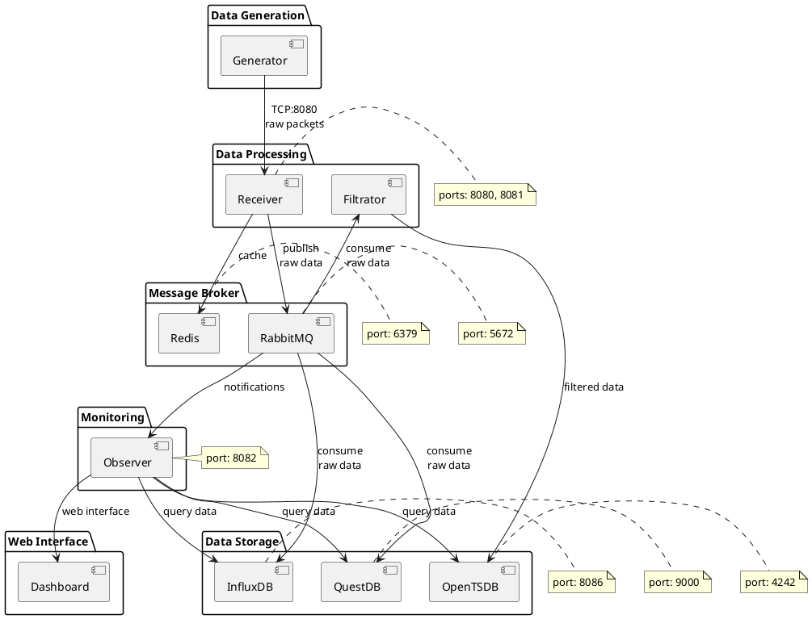
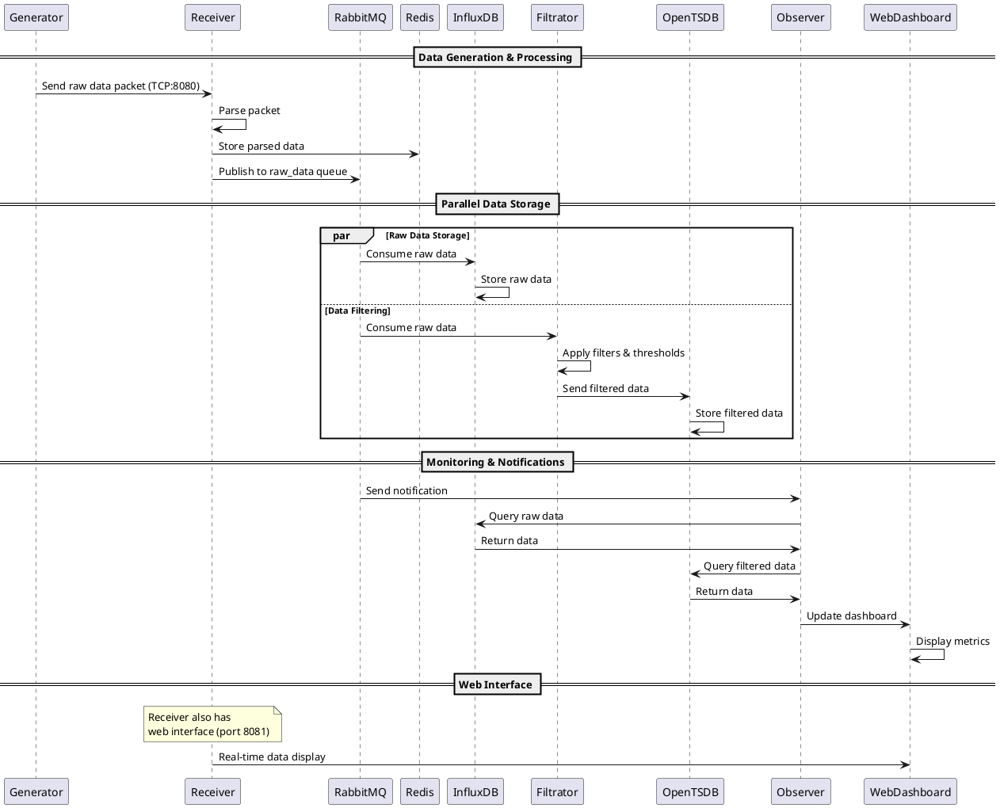
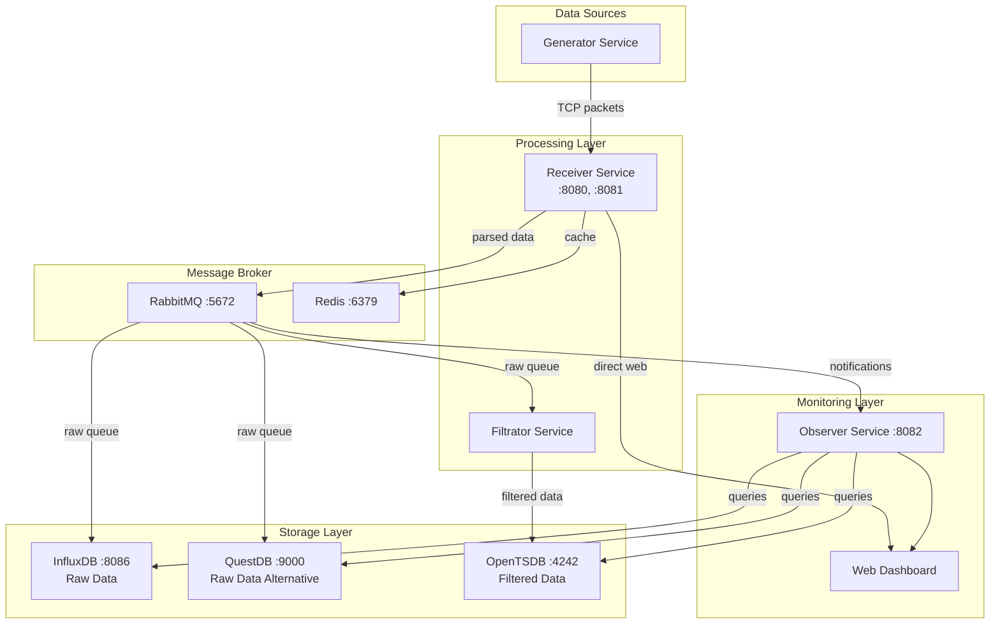
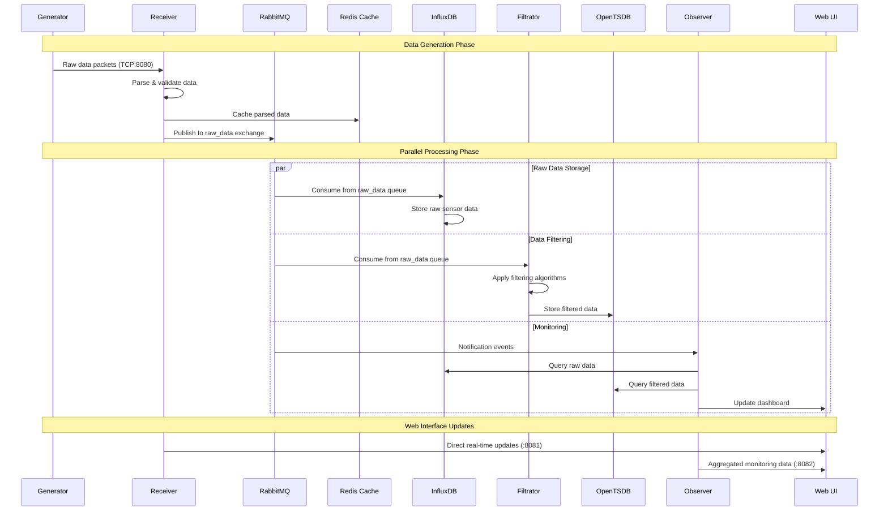

# Задача
    В этом проекте сервис generator создает пакеты данных и выбрасывает их в сеть.
    Сервис receiver создает сервер для работы своего web представителя как go-рутину на порту 8081, также создает слушателя на порту 8080 и принимает пакеты данных, сам их препарирует и сам выводит в консоль посредством логов и в веб интерфейс своей подсистемой, заключенной в каталоги internal/web и static.
    Надо, чтобы данные приходили в receiver, но тот в свою очередь (будучи подписанным на брокера Rabbitmq+Redis в канал и очередь гнал бы данные подписчикам сервисам fitrator и сервису InfluxDB (или QuestDB)), а те в свою очередь должны быть подписчиками в соответствующих каналах и очередях.
    Сервис Filtrator прореживает данные опираясь на свои алгоритмы в пределах соответствия порогам сверху и снизу и тренду и также имея подписку как отправитель - отправляет обработанные данные  сервису хранения, построенному на базе OpenTSDB.
    Сервис OpenTSDB также подписан у брокера как получатель данных после прореживания от сервиса Filtrator.
    Сервис же InfluxDB (или QuestDB) подписаны как получатели сырых данных.
    Возможно построения отдельного сервиса observer, который будет обращаться к сервису БД InfluxDB (или QuestDB) по пришествии ему сообщения от rabbitmq.
    Observer  будет содержать в себе весь функционал веб интерфейса.
    Требуется: структура проекта как json, plantuml и как Diagramms формат.
    Диаграмма всей структуры проекта с отношениями.
    Диаграмма движения данных, запросов, ответов, логов и пр. во времени.
    Возможно, еще какие-то диаграммы.

## JSON структура проекта
```json
{
  "project": "gendata-distributed-system",
  "architecture": "microservices",
  "services": {
    "generator": {
      "description": "Генерирует пакеты данных",
      "port": null,
      "dependencies": ["receiver"],
      "outputs": ["raw_data_packets"]
    },
    "receiver": {
      "description": "Принимает данные, парсит и распределяет",
      "ports": [8080, 8081],
      "dependencies": ["rabbitmq", "redis"],
      "inputs": ["raw_data_packets"],
      "outputs": ["parsed_data_to_queue", "web_interface"]
    },
    "filtrator": {
      "description": "Фильтрует и прореживает данные",
      "dependencies": ["rabbitmq", "redis", "opentsdb"],
      "inputs": ["raw_data_from_queue"],
      "outputs": ["filtered_data_to_opentsdb"]
    },
    "influxdb": {
      "description": "Хранит сырые данные",
      "port": 8086,
      "dependencies": ["rabbitmq"],
      "inputs": ["raw_data_from_queue"],
      "outputs": ["stored_raw_data"]
    },
    "questdb": {
      "description": "Альтернатива InfluxDB",
      "port": 9000,
      "dependencies": ["rabbitmq"],
      "inputs": ["raw_data_from_queue"],
      "outputs": ["stored_raw_data"]
    },
    "opentsdb": {
      "description": "Хранит отфильтрованные данные",
      "port": 4242,
      "dependencies": ["rabbitmq"],
      "inputs": ["filtered_data_from_queue"],
      "outputs": ["stored_filtered_data"]
    },
    "observer": {
      "description": "Веб-интерфейс для мониторинга",
      "port": 8082,
      "dependencies": ["rabbitmq", "influxdb", "questdb", "opentsdb"],
      "inputs": ["notifications_from_queue", "db_queries"],
      "outputs": ["web_dashboard"]
    }
  },
  "infrastructure": {
    "rabbitmq": {
      "port": 5672,
      "queues": ["raw_data", "filtered_data", "notifications"],
      "exchanges": ["data_exchange"]
    },
    "redis": {
      "port": 6379,
      "usage": ["caching", "session_storage"]
    }
  },
  "data_flow": {
    "raw_data_path": "generator -> receiver -> rabbitmq -> [influxdb|questdb]",
    "filtered_data_path": "receiver -> rabbitmq -> filtrator -> opentsdb",
    "monitoring_path": "rabbitmq -> observer -> web_dashboard"
  }
}
```

## PlantUML - Архитектура системы


## PlantUML - Диаграмма последовательности (Data Flow)


## Mermaid - Архитектура компонентов


## Mermaid - Диаграмма потоков данных
